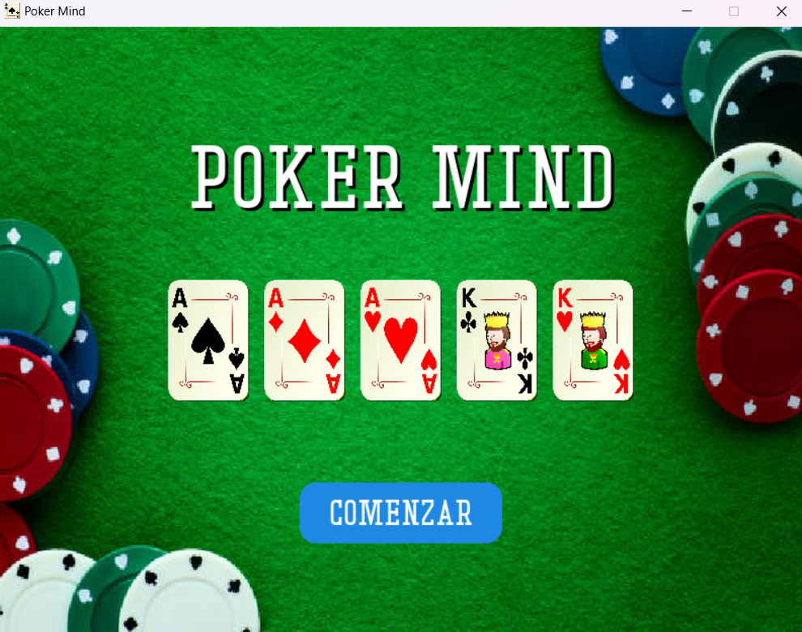
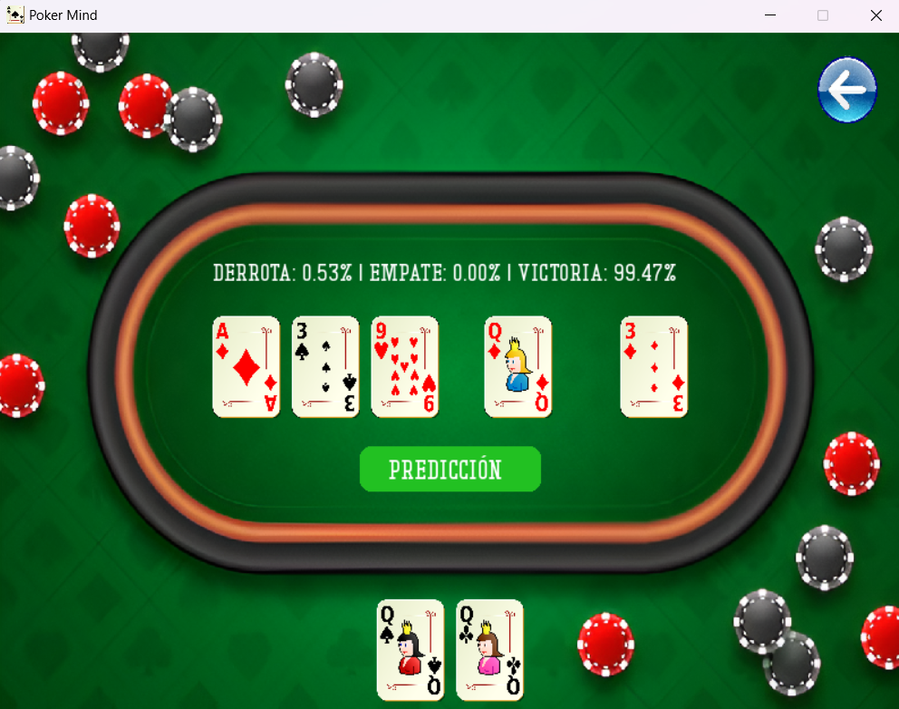

# POKER MIND

Poker Mind es un proyecto de Ciencia de Datos e Inteligencia Artificial.
Este proyecto se centra en la generación y análisis de datos de 2 Millones de manos para analizar estadísticas, comportamientos y patrones. Posteriormente implementa un modelo de red neuronal artificial (ANN) capáz de generar predicciones en tiempo real a lo largo de las etapas de una mano de Poker de probabilidades de victoria, porcentaje de conectar manos y recomendaciones de acciónes que debe tomar el jugador en base a su situación en cada momento.

Además Poker Mind cuenta con una App con interfaz gráfica para poder probar el modelo.

A continuación, se detallan los tres notebooks principales del proyecto + la App final de Poker Mind.

## 1. Creación del Dataset mediante Simulaciones de Monte Carlo

En esta sección, se genera un **dataset** mediante simulaciones de Monte Carlo. La idea es generar una enorme base de datos con 2 Millones de manos con las que trabajaremos posteriormente (Más detalles en el notebook dataset.ipynb). Los datos se almacenan en un archivo CSV que es utilizado posteriormente para análisis y entrenamiento del modelo.

El archivo generado ocupa demasiado como para poder subirlo al repositorio, por lo que hay dos opciones.

- Pueden ejecutar el notebook en su equipo y generar su propio dataset para trabajar con el numero de simulaciones que consideren.

- Si desean trabajar con el dataset original les dejo el enlace de descarga para que lo añadan al proyecto en su equipo.

Enlace de descarga de `simulacion_montecarlo.csv` [Google Drive](https://drive.google.com/file/d/1w0AvoduuTIo-RGb4bNtqu1VnjzA7oNXE/view?usp=drive_link).

## 2. Análisis de Datos y Visualización mediante Gráficas

En esta parte, se realiza un **análisis exploratorio de los datos** obtenidos de las simulaciones. Se emplean diversas herramientas y librerías como Pandas y Plotly Express para visualizar y entender patrones en el dataset. Se generan gráficas y análisis estadísticos que permiten descubrir tendencias y comportamientos interesantes relacionados con el juego de póker.

## 3. Modelo de Red Neuronal Artificial (ANN)

Finalmente, se implementa un **modelo de red neuronal artificial (ANN)** para predecir el desnelace de una mano de póker. Usando los datos previamente analizados, se entrena un modelo para realizar predicciones sobre las probabilidades de ganar con una determinada mano, así como para optimizar las decisiones de juego en función de las cartas del oponente y otras variables.

## 4. Interfaz Gráfica de Usuario (GUI)



La aplicación Poker Mind cuenta con una interfaz gráfica que permite visualizar de manera interactiva las predicciones del modelo ANN en base a los datos que le proporciones sobre la mano que quieres predecir. En esta App le pedimos al usuario que introduzca las dos cartas iniciales que se le entregan en la mano, el número de rivales a los que se enfrenta y las cartas comunitarias que han salido, y el modelo se encarga de mostrar de manera visual las probabilidades de Victoria/Empate/Derrota que tiene el jugador de ganar esa mano en base a los datos proporcionados.

A continuación se muestra una imagen de la interfaz gráfica de la aplicación en ejecución.



## Instalación

Para comenzar a trabajar con este proyecto, sigue los siguientes pasos:

1. Clona este repositorio:

   ```bash
   git clone git@github.com:rramirezsoft/poker-mind.git
   ```

2. instala las dependencias necesarias:
   ```bash
   pip install -r requirements.txt
   ```

## USO

1. **Generación de Dataset**: El script para generar las simulaciones de Monte Carlo se encuentra en el archivo `dataset.ipynb`. Simplemente ejecuta el archivo para generar un nuevo dataset de simulaciones o descarga el archivo ya generado en el enlace de arriba.

2. **Análisis de Datos**: El análisis de los datos generados se realiza en el archivo `data_analysis.ipynb`, donde puedes explorar y visualizar las diferentes métricas y patrones de las simulaciones.

3. **Entrenamiento del Modelo de ANN**: Para entrenar el modelo de red neuronal, utiliza el archivo `poker_ai.ipynb`, donde se emplean los datos procesados para entrenar y evaluar el modelo de predicción.

4. **Uso de Interfaz Gráfica**: Para ejecutar la App de Poker Mind accede a la ruta app/ y una vez ahí ejecutas el comando `python app.py` en la terminal.
